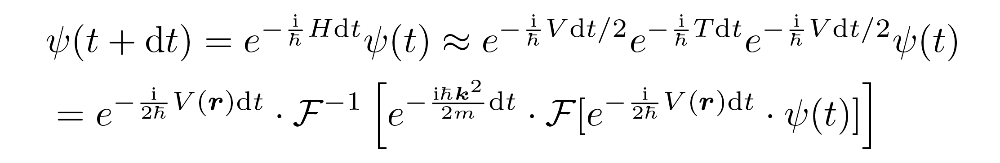
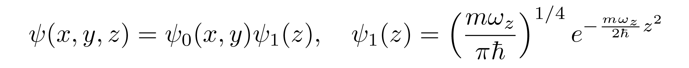
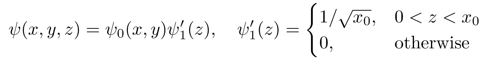

# BEC_Dynamics_2D
[](https://github.com/ShiShuoyu/BEC_Dynamics_2D/blob/main/LICENSE)

<div align=center>

</div>

Simulating and visualizing the mechanical motion of 2D Bose-Einstein condensates (BECs)  
*(This repository is under construction...)*

## Highlights
- Simulation with units, which is more friendly to beginners and students.
- Sampling the mechanical quantity (e.g. the angular momentum of the wavepacket) during time evolution.
- GPU acceleration via CUPY.

## Physical Settings

### 3D → 2D
Here we assume that **the degree of freedom in *z* direction is locked in the ground state** of a 1D harmonic trap, and we only consider *xy* plane.

### Numerical Method
Put the wavefunction in a 2D grid and solving the time dependent Gross-Pitaevskii equation by split-step method using FFT.
<div align=center>

</div>

### Hamiltonian
**quadratic dispersion relation** + **tunable anharmonic trap** + **mean-field interacting term**
<div align=center>

</div>

Here **r** = (x,y), not (x,y,z)

### Interacting strength *g*
The *physical-makesense* wavefunction is
<div align=center>

</div>

However, we neglect the degree of freedom in *z* direction, and **the grid in computer is 2D**, so it actually represents a *physical-nonsense* wavefunction
<div align=center>

</div>

Where *x_0* is the demensionless unit in the simulation that is set to 1 μm. It is equal to squeezing the wavepacket into a pancake, and the interacting term in GP equation will explode. To fix things up, we have to renormalize the interacting strength *g*. The energy functional is
<div align=center>

</div>

Let the interacting term in the energy functional be the same for both *makesense* and *nonsense* wavefunction, and the renormalized *g'* is obtained
<div align=center>

</div>

### Why 2D?
- 2D simulation is much more faster than its 3D counterpart, and much more interesting than 1D case.
- Our eyes can only handle 2D images.

## Getting Started
1. create an conda environment
```Terminal
cd BEC_Dynamic_2D
conda env create -f environment.yml
conda activate env_bec
```
2. try examples
```Terminal
cd src
mkdir output
python main.py --help
python main.py --video
```