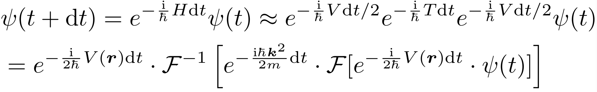

# BEC_Dynamics_2D
Simulating and visualizing the mechanical motion of 2D Bose-Einstein condensates (BECs)  
*(This repository is under construction...)*

## Physical Settings
**quadratic dispersion relation** + **tunable anharmonic trap** + **mean-field interacting term**

## Numerical Method
Solving the time dependent Gross-Pitaevskii equation by split-step method using FFT.

## Why 2D?
- 2D simulation is much more faster than its 3D counterpart, and much more interesting than 1D case.
- Our eyes can only handle 2D images.

## Highlights
- Simulation with units, which is more friendly to beginners.
- Sampling the mechanical quantity (e.g. the angular momentum of the wavepacket) during time evolution.
- GPU acceleration via CUPY.